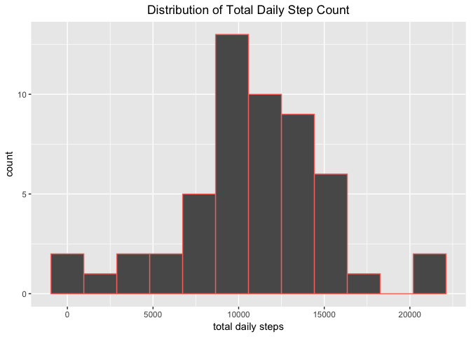
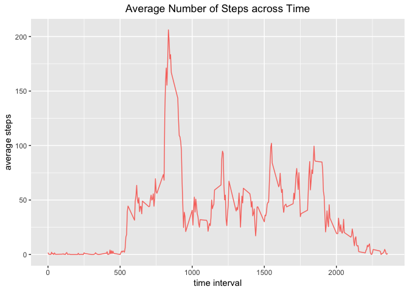
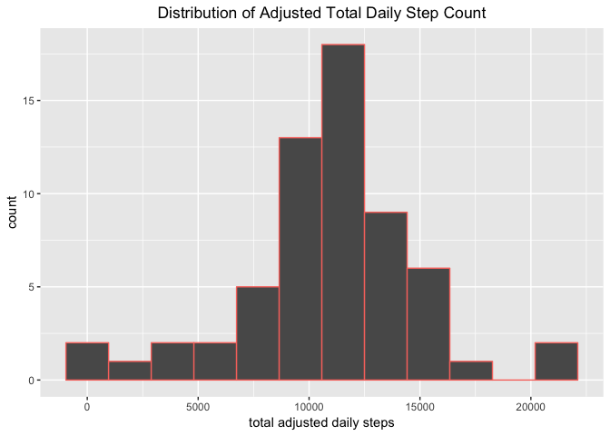
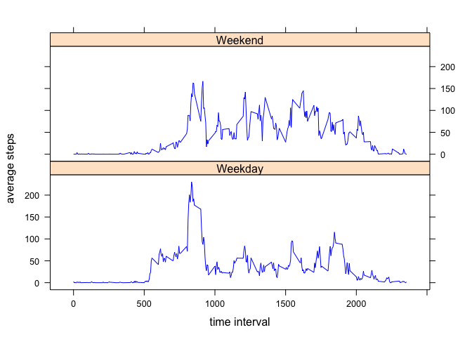

  

## Loading and preprocessing the data
<br/>
  
#### Loading the data
First, we download and unzip the following file into the user's working 
directory: [activity.zip][1]  
Then we read it into R.  For the following analyses, it is presupposed that the 
R packages ```lubridate```, ```dplyr```, ```ggplot2```, ```lattice``` are 
already installed. 
<br/>
<br/>


```r
library(lubridate)
library(dplyr)
library(ggplot2)
library(lattice)
```


```r
## Download, unzip data 
url <-"https://d396qusza40orc.cloudfront.net/repdata%2Fdata%2Factivity.zip"
download.file(url,
              destfile='./activity.zip',
              method="curl",
              mode="wb")
unzip(zipfile = "activity.zip") 
activity <-read.csv("activity.csv")
```


```r
head(activity, n = 3)
```

```
##   steps       date interval
## 1    NA 2012-10-01        0
## 2    NA 2012-10-01        5
## 3    NA 2012-10-01       10
```
<br/>

#### Processing/transforming the data  
  
Notice that the data set is already tidy, so we do not need to process it any 
further.  
<br/><br/>  
    
## What is mean total number of steps taken per day?  
<br/>
The code below: 

- calculates the total number of steps taken for each day,  
- generates a **histogram** of the total number of steps taken for each day,  
- calculates and reports the **mean** and **median** total number of steps taken 
daily.  
<br/>
<br/>


```r
dailysums <- activity %>% select(date, steps) %>% group_by(date) %>% 
        summarize(sumsteps = sum(steps))
g <- ggplot(dailysums, aes(sumsteps))
g + geom_histogram(bins = 12, na.rm = TRUE, 
                aes(color = "blue"), show.legend = FALSE) +
        labs(x = "total daily steps",
             title = "Distribution of Total Daily Step Count") +
        theme(plot.title = element_text(hjust = 0.5))
```

<!-- -->


```r
dailysums %>% summarize("mean daily steps" = mean(sumsteps, na.rm = TRUE),
                  "median daily steps" = median(sumsteps, na.rm = TRUE)) %>%
print.data.frame
```

```
##   mean daily steps median daily steps
## 1         10766.19              10765
```
<br/>
Visually inspecting the histogram, we see that the 
total daily step count corresponding to this data set appear to be somewhat 
left-skewed. However, the mean and median daily step totals are virtually 
identical, probably due to the two unusually large step totals in the right tail "counterbalancing" the left skew, in what is not a particularly large dataset.
<br/>
<br/>

  
  
## What is the average daily activity pattern?   
<br/>
The code below: 

- calculates the mean number of steps taken for each interval value, averaged 
across all days,
- generates a **time series plot** of the interval value versus the mean number 
of steps taken for that interval,  
- calculates and reports the specific interval that has the **maximum** mean 
number of steps.  
<br/>
<br/>
    

```r
meanintsteps <- activity %>% select (interval, steps) %>% group_by(interval) %>%
        summarize("meansteps" = mean(steps, na.rm = TRUE)) 
```


```r
ggplot(meanintsteps, aes(interval, meansteps)) + geom_line(aes(color = "blue"),
                                                           show.legend = FALSE) +
        labs(x = "time interval", y = "average steps",
             title = "Average Number of Steps across Time") +
        theme(plot.title = element_text(hjust = 0.5))
```

<!-- -->


```r
print.data.frame(filter(meanintsteps, meansteps == max(meansteps)))
```

```
##   interval meansteps
## 1      835  206.1698
```
<br/>
The time series plot has several interesting features, of which we will mention 
two.  Immediately noticeable is that the average steps is essentially zero for 
the first 500-odd intervals. In the context of the data, this makes sense, as 
those intervals almost certainly would correspond to the times when the person 
in the study were asleep.  
In addition, there is a noticeable spike in the average number of steps, 
occurring approximately between the intervals 800 and 900.  More specifically, 
the interval equal to 835 has the largest average number of steps.
One potential explanation is that the person exercises in the aforementioned 
time period.
<br/>
<br/>
  
  
  
## Imputing missing values    
<br/>

The code below: 

- calculates and reports the total number of missing values in the data set,
- for any missing values, imputes the mean number of steps 
corresponding to the interval,
- creates a new data set with the imputed data,
- generates a histogram of the total number of steps taken each day, and 
calculates and reports the mean and median total number of steps taken per day.

<br/>

```r
datanas<-apply(activity,2,is.na)
datanasbycol<-apply(datanas,2,sum)
print(datanasbycol)
```

```
##    steps     date interval 
##     2304        0        0
```


```r
augactivity <- left_join(activity, meanintsteps, by = "interval") 
augimpute <- mutate(augactivity, 
       steps = ifelse(is.na(augactivity$steps), augactivity$meansteps, 
                      augactivity$steps) )
activityimpute <- select(augimpute, steps, date, interval)
```


```r
head(activityimpute, n = 3)
```

```
##       steps       date interval
## 1 1.7169811 2012-10-01        0
## 2 0.3396226 2012-10-01        5
## 3 0.1320755 2012-10-01       10
```


```r
dailysumsimpute <- activityimpute %>% select(date, steps) %>% group_by(date) %>% 
        summarize(sumsteps = sum(steps))
g <- ggplot(dailysumsimpute, aes(sumsteps))
g + geom_histogram(bins = 12, na.rm = TRUE, 
                aes(color = "blue"), show.legend = FALSE) +
        labs(x = "total adjusted daily steps",
             title = "Distribution of Adjusted Total Daily Step Count") +
        theme(plot.title = element_text(hjust = 0.5))
```

<!-- -->


```r
dailysumsimpute %>% summarize("adjusted mean daily steps" = 
                                      mean(sumsteps, na.rm = TRUE), 
                              "adjusted median daily steps" = 
                                      median(sumsteps, na.rm = TRUE)) %>% print.data.frame
```

```
##   adjusted mean daily steps adjusted median daily steps
## 1                  10766.19                    10766.19
```

<br/>

Since 1) the NAs were ignored in the original computation of the mean (as 
opposed to being assigned the value '0', for example), and 2) the NAs were 
uniformly distributed across *all* intervals, imputing the within-interval mean 
for all NAs in each interval will *not* change the overall mean.  
Regarding the 
median, as there were initially several *complete* days with missing values, the 
imputed values for those days will actually result in a resultant step total 
equal to the overall mean daily total steps; this is why the median equals 
the mean.  In this example, if the *location* of the missing values 
actually differed *within* each day, say, then this would *not* be the 
case, however. 
<br/>
<br/>

## Are there differences in activity patterns between weekdays and weekends?  
<br/>

The code below: 

- creates a new factor variable in the data set with two levels corresponding to
whether a given day is a weekday or a weekend,  
- generates a panel plot containing two time series plots of the average total 
number of steps across intervals; each time series plot corresponding to
weekend or weekday data respectively. 

<br/>

```r
activityimputeday <- 
        activityimpute %>% 
        mutate(day = weekdays(ymd(date)), 
               daytype = if_else(day == "Saturday" | 
                                         day == "Sunday", "Weekend", "Weekday"), 
               daytype = factor(daytype))
```


```r
meanbydayintsteps <- activityimputeday %>% select(daytype, interval, steps) %>% 
        group_by_at(vars(daytype,interval)) %>%
        summarize("meansteps" = mean(steps, na.rm = TRUE)) 
```


```r
xyplot(meansteps ~ interval | daytype, data = meanbydayintsteps, layout =c(1,2),
       xlab = "time interval", ylab = "average steps", type = "l", col = "blue")
```

<!-- -->

<br/>
  
Examining the time series plots, we can see that, amongst other things:  

-  there appears to be somewhat greater variability in step totals across intervals 
during the weekend,  
-  the step totals for weekdays are around zero for a shorter duration in the 
starting intervals, indicating an earlier wake-up time (perhaps due to a job),  
-  the step totals for the later intervals decrease and level off slightly earlier 
for the weekdays, indicating a slightly earlier bedtime,  
-  the peak average step total occurs roughly around the same interval for both 
weekdays and the weekend.  
<br/>
<br/>
<br/>

[1]: https://d396qusza40orc.cloudfront.net/repdata%2Fdata%2Factivity.zip "activity.zip"

