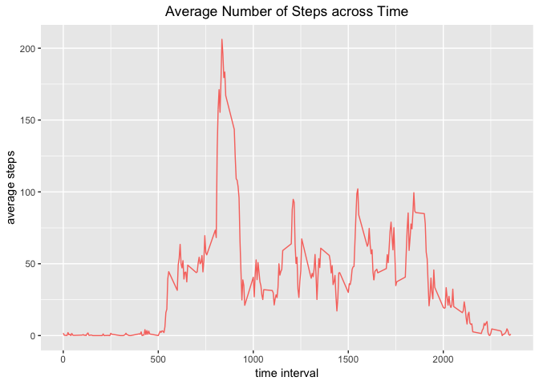

## Loading and preprocessing the data  
  
   
First, we download and unzip the following file into the user's working 
directory: [activity.zip][1]  
Then we read it into R.  For the following analyses, it is presupposed that the 
R packages ```lubridate```, ```dplyr```, ```ggplot2```, ```lattice``` are 
already installed. 


```r
library(lubridate)
library(dplyr)
library(ggplot2)
library(lattice)
```


```r
## Download, unzip data 
url <-"https://d396qusza40orc.cloudfront.net/repdata%2Fdata%2Factivity.zip"
download.file(url,
              destfile='./activity.zip',
              method="curl",
              mode="wb")
unzip(zipfile = "activity.zip") 
activity <-read.csv("activity.csv")
```


```r
head(activity, n = 3)
```

```
##   steps       date interval
## 1    NA 2012-10-01        0
## 2    NA 2012-10-01        5
## 3    NA 2012-10-01       10
```
Notice that the data set is already tidy, so we do not need to process it any 
further.  
  
  
    
## What is mean total number of steps taken per day?  
The code below: 

- calculates the total number of steps taken for each day,  
- generates a **histogram** of the total number of steps taken for each day,  
- calculates and reports the **mean** and **median** total number of steps taken daily.  


```r
dailysums <- activity %>% select(date, steps) %>% group_by(date) %>% 
        summarize(sumsteps = sum(steps))
g <- ggplot(dailysums, aes(sumsteps))
g + geom_histogram(bins = 12, na.rm = TRUE, 
                aes(color = "blue"), show.legend = FALSE) +
        labs(x = "total daily steps",
             title = "Distribution of Total Daily Step Count") +
        theme(plot.title = element_text(hjust = 0.5))
```

<!-- -->


```r
dailysums %>% summarize("mean daily steps" = mean(sumsteps, na.rm = TRUE),
                  "median daily steps" = median(sumsteps, na.rm = TRUE)) %>%
print.data.frame
```

```
##   mean daily steps median daily steps
## 1         10766.19              10765
```
  
  
  
## What is the average daily activity pattern?  
  
    

```r
meanintsteps <- activity %>% select (interval, steps) %>% group_by(interval) %>%
        summarize("meansteps" = mean(steps, na.rm = TRUE)) 
```


```r
ggplot(meanintsteps, aes(interval, meansteps)) + geom_line(aes(color = "blue"),
                                                           show.legend = FALSE) +
        labs(x = "time interval", y = "average steps",
             title = "Average Number of Steps across Time") +
        theme(plot.title = element_text(hjust = 0.5))
```

<!-- -->


```r
print.data.frame(filter(meanintsteps, meansteps == max(meansteps)))
```

```
##   interval meansteps
## 1      835  206.1698
```
  
  
  
## Imputing missing values  

```r
augactivity <- left_join(activity, meanintsteps, by = "interval") 
augimpute <- mutate(augactivity, 
       steps = ifelse(is.na(augactivity$steps), augactivity$meansteps, 
                      augactivity$steps) )
activityimpute <- select(augimpute, steps, date, interval)
```


```r
head(activityimpute, n = 3)
```

```
##       steps       date interval
## 1 1.7169811 2012-10-01        0
## 2 0.3396226 2012-10-01        5
## 3 0.1320755 2012-10-01       10
```


```r
dailysumsimpute <- activityimpute %>% select(date, steps) %>% group_by(date) %>% 
        summarize(sumsteps = sum(steps))
g <- ggplot(dailysumsimpute, aes(sumsteps))
g + geom_histogram(bins = 12, na.rm = TRUE, 
                aes(color = "blue"), show.legend = FALSE) +
        labs(x = "total adjusted daily steps",
             title = "Distribution of Adjusted Total Daily Step Count") +
        theme(plot.title = element_text(hjust = 0.5))
```

<!-- -->


```r
dailysumsimpute %>% summarize("adjusted mean daily steps" = 
                                      mean(sumsteps, na.rm = TRUE), 
                              "adjusted median daily steps" = 
                                      median(sumsteps, na.rm = TRUE)) %>% print.data.frame
```

```
##   adjusted mean daily steps adjusted median daily steps
## 1                  10766.19                    10766.19
```


Since 1) the NAs were ignored in the original computation of the mean (as 
opposed to being assigned the value '0', for example), and 2) the NAs were 
uniformly distributed across *all* intervals, imputing the within-interval mean 
for all NAs in each interval will *not* change the overall mean.  
  
  
  
## Are there differences in activity patterns between weekdays and weekends?


```r
activityimputeday <- 
        activityimpute %>% 
        mutate(day = weekdays(ymd(date)), 
               daytype = if_else(day == "Saturday" | 
                                         day == "Sunday", "Weekend", "Weekday"), 
               daytype = factor(daytype))
```


```r
meanbydayintsteps <- activityimputeday %>% select(daytype, interval, steps) %>% 
        group_by_at(vars(daytype,interval)) %>%
        summarize("meansteps" = mean(steps, na.rm = TRUE)) 
```


[1]: https://d396qusza40orc.cloudfront.net/repdata%2Fdata%2Factivity.zip "activity.zip"

Of course, notwithstanding
